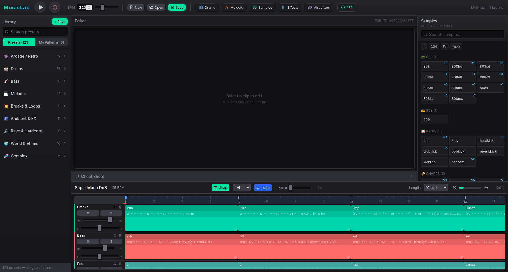

# MusicLab

A powerful web-based music production environment built on [Strudel](https://strudel.cc/), the JavaScript port of TidalCycles. Create beats, melodies, and full compositions using live coding or visual sequencers.



## Features

### DAW-Style Arrangement View
- Multi-track timeline with drag-and-drop clips
- Real-time playhead animation synced to audio engine
- Track controls: Mute, Solo, Volume, Pan per track
- Clip positioning with snap-to-grid
- Loop regions with visual markers
- Zoom and scroll controls
- Double-click to create inline clips
- Drag patterns from library to timeline

### Live Coding Editor
- Real-time pattern evaluation with Strudel mini notation
- Syntax highlighting and autocomplete for 296+ samples
- Per-clip code editing in arrangement
- Cheat sheet with pattern examples and sample browser

### Step Sequencer (Drum Machine)
- 8/16/32 step grid with 32 drum sounds
- Swing control (0-100%)
- 30+ genre presets (Hip Hop, Techno, House, Trap, etc.)
- Real-time preview with visual step indicator
- Pro UI with glass panels and glow effects

### Melodic Sequencer
- Piano-roll style note input (C-B, octaves 1-6)
- 10 synthesizer sounds (Arpy, Pluck, Moog, Juno, FM, etc.)
- 8 melodic presets (arpeggios, basslines, melodies)
- Color-coded notes for easy visualization
- Pro UI with glass panels and glow effects

### Track Mixer
- Unlimited tracks with solo/mute controls
- Per-track parameters: Gain, Pan, Speed, Cutoff, Resonance
- FT2-style oscilloscope per channel
- Stack drum patterns with melodies seamlessly

### Audio Visualizer
- 41 visualization modes in 7 categories (Frequency, Waveform, Particles, Geometric, Nature, Retro, Abstract)
- 34 post-processing effects (CRT, VHS, Bloom, Glitch, Mirror, Beat-reactive, and more)
- 10 color palettes with live gradient preview
- All modes react to bass, mid, and high frequency bands in real-time
- Fullscreen with dropdown selectors for modes, FX, and palettes

### Recording
- Record your sessions to audio files
- Export as WAV or WebM format
- Built-in audio conversion

### Pattern Library
- 111 built-in presets across 10 categories (Drums, Bass, Melodic, Ambient, etc.)
- Retro/Arcade sample category with Space Invaders, SID chip, and classic game sounds
- Drag-and-drop presets to timeline
- Searchable browser with emoji category icons
- Save your own patterns

### Project Management
- Save and load full arrangements with tracks, loop ranges, groove, and automation
- Export/import projects as JSON using the canonical v2.x project schema
- Backwards compatible with legacy layer format and older stored projects

## Installation

```bash
# Clone the repository
git clone https://github.com/zubenelakrab/musiclab.git
cd musiclab

# Install all dependencies (client + server)
npm install
cd server && npm install && cd ..

# Start everything (client + server)
npm run dev
```

- **Client**: http://localhost:5173
- **Server API**: http://localhost:3001

## Usage

### Quick Start

1. Click anywhere to initialize audio
2. Type a pattern in the editor: `bd sd hh oh`
3. Press Play or hit the play button
4. Adjust BPM with the tempo slider

### Pattern Syntax (Mini Notation)

```javascript
// Basic drum pattern
bd sd bd sd

// Hi-hat pattern with rests
hh hh ~ hh

// Grouping (plays faster)
[bd bd] sd [hh hh hh] sd

// Alternating patterns
<bd sd> hh

// Euclidean rhythms
bd(3,8)

// With effects
bd sd hh oh .speed(1.5) .gain(0.8)
```

### Sample Categories

| Category | Examples |
|----------|----------|
| Kicks | bd, kick, hardkick, softkick |
| Snares | sd, sn, snare, rim, clap, cp |
| Hi-hats | hh, ch, ho, chh, ohh |
| Percussion | perc, conga, bongo, tabla |
| Bass | bass, bass1, jvbass, moog |
| Synths | arpy, pluck, juno, fm |
| FX | noise, glitch, metal |

### Keyboard Shortcuts

| Key | Action |
|-----|--------|
| `Ctrl/Cmd + Enter` | Evaluate pattern |
| `Ctrl/Cmd + .` | Stop playback |

## Architecture

```
MusicLab/
├── client/                 # React + Vite frontend
│   ├── src/
│   │   ├── components/     # UI components
│   │   │   ├── ArrangementView/  # DAW-style timeline
│   │   │   ├── Editor/     # Code editor, cheat sheet
│   │   │   ├── StepSequencer/    # Drum machine
│   │   │   ├── MelodicSequencer/ # Note sequencer
│   │   │   ├── Visualizer/       # Audio visualizations
│   │   │   └── Transport/        # Playback controls
│   │   ├── hooks/          # useStrudel, useArrangement
│   │   ├── store/          # Zustand state management
│   │   ├── strudel/        # Audio engine wrapper
│   │   └── data/           # Sample database
│   └── package.json
├── server/                 # Express backend (optional)
│   ├── routes/             # API routes
│   └── db/                 # JSON file storage
└── package.json            # Monorepo config
```

## Tech Stack

- **Frontend**: React 18, Vite, Tailwind CSS
- **Audio**: Strudel (@strudel/core, @strudel/mini, @strudel/webaudio)
- **Editor**: CodeMirror 6
- **State**: Zustand
- **Icons**: Lucide React
- **Backend**: Express (optional, for pattern storage)

## Development

```bash
# Run everything (client + server)
npm run dev

# Run client only (no server)
npm run dev:client

# Run server only
npm run dev:server

# Build client for production
npm run build

# Preview production build
npm run preview

# Lint source code
npm run lint

# Run automated tests
npm test

# Full local verification
npm run verify
```

### Server API Endpoints

| Endpoint | Method | Description |
|----------|--------|-------------|
| `/api/health` | GET | Health check |
| `/api/patterns` | GET/POST | List and create patterns |
| `/api/patterns/:id` | GET/PUT/DELETE | Read, update, and delete patterns |
| `/api/projects` | GET/POST | List and create canonical project documents |
| `/api/projects/:id` | GET/PUT/DELETE | Read, update, and delete projects |

### Quality Gates

- `npm run lint` checks the repo with ESLint
- `npm test` runs the Node-based regression suite for project schema and store behavior
- `npm run verify` runs lint, tests, and production build in one command
- GitHub Actions CI mirrors the same verification flow on push and pull request

## Browser Support

MusicLab requires a modern browser with Web Audio API support:
- Chrome/Edge 80+
- Firefox 75+
- Safari 14+

## Samples

MusicLab uses the [Dirt-Samples](https://github.com/tidalcycles/Dirt-Samples) collection from TidalCycles, providing 296+ high-quality samples across 19 categories including a curated Retro/Arcade collection.

## Changelog

### v2.2.0 (2026-07-12)
- **Default song**: the app now opens with a ready-to-play drum & bass sketch (intro/break/build/drop drums, reese + rolling sub bass, juno/glass pads, pluck/arpy lead) at a default tempo of 115 BPM; "New" uses the same template.
- **Effects & sample routing**: the Effects Rack and Sample Browser now edit the clip currently in edition so changes are actually audible in the arrangement.
- **Preview/transport safety**: previewing a sample no longer halts the running transport, and closing a sequencer while playing no longer stops arrangement playback.
- **BPM handling**: BPM is validated (finite, > 0, capped at 400) so a bad value can't freeze the scheduler.
- **Arrangement UX**: fixed the frozen track-control column painting under selected clips on horizontal scroll, tightened TrackControls layout, and removed clipping from the Effects Rack panel.
- **Sequencer fixes**: swing is preserved when adding a pattern as a track, preview restarts/stops correctly on tempo, step-count, and empty-grid changes, and the melodic sequencer no longer mutates base octave inside a state updater.
- **Persistence**: server JSON store now writes atomically (temp file + rename) to avoid corruption from concurrent writes; `loadProject` uses nullish fallbacks for loop/length/BPM.
- **Docs**: updated the README screenshot.

### v2.1.0 (2026-03-22)
- **Project persistence overhaul**: unified the canonical project schema across client export/import, autosave, and server API; groove, automation, loop metadata, and legacy projects now round-trip correctly.
- **Safer loading flows**: opening/importing projects now validates data earlier, prompts before destructive replacement, and resets arrangement view/playhead state when switching projects.
- **Arrangement interaction fixes**: corrected clip placement and drag behavior when the timeline is horizontally scrolled, and routed "Add as Track" through store actions so undo/autosave stay in sync.
- **Playback sync fixes**: transport now stops cleanly if the arrangement becomes empty during playback, starts the playhead from `loopStart` when looping, and preview sessions take over the scheduler without leaking stale transport state.
- **Frontend performance**: lazy-loaded heavy panels such as Visualizer, sequencers, sample browser, effects, and About modal; added chunk splitting to reduce the initial bundle cost.
- **Quality tooling**: added ESLint, automated tests, `npm run verify`, and CI coverage for project schema, persistence, and store/playback regression checks.

### v2.0.2 (2026-02-27)
- **Pro Tactile UI**: Complete visual overhaul replacing flat glows with a deeper "slate" theme, inset panels, and hardware-style tactile buttons for a more professional DAW experience.
- **NFO About Modal**: Added a classic cracking-scene style NFO viewer modal with ASCII art, CRT effects, and scrolling marquees.

### v2.0.1 (2026-02-26)
- **Arrangement performance**: reduced unnecessary re-renders by migrating key views/hooks to Zustand selectors and isolating playhead updates.
- **Step Sequencer randomization**: random button now randomizes both sound and available `:1`/`:2` sample variation under the same action.
- **Automation/Groove UI**: improved floating controls panel readability and fixed value feedback for automation point sliders.
- **Snap/Grid/Zoom fixes**: corrected snap behavior in drag/drop and ruler interactions; improved subdivision visuals and zoom-out floor handling.
- **Playback sync fixes**: preview playback in Step/Melodic sequencers now correctly updates transport play state.
- **Data safety**: server JSON store migrated to async I/O with route-level error handling and per-collection write serialization to reduce race-condition overwrites.
- **Project persistence**: fixed arrangement ID persistence flow and related autosave reliability issues.

### v2.0.0 (2026-02-13)
- **Visualizer overhaul**: 41 audio-reactive modes (spectrum, terrain, constellation, matrix, aurora, flame, and 35 more) organized in 7 categories with dropdown selector
- **34 post-processing FX**: CRT, VHS, bloom, glitch, RGB split, beat zoom, screen shake, mirrors, and more — multi-select categorized panel
- **10 color palettes**: Classic, Neon, Fire, Ocean, Matrix, Ice, Sunset, Cyber, Acid, Rainbow with gradient preview dropdown
- **Enhanced particles**: Fullscreen coverage with additive blending, radial gradients, higher particle counts
- **111 pattern presets**: 10 categories (Drums, Bass, Melodic, Ambient, FX, World, Experimental, etc.) with searchable browser
- **Retro/Arcade samples**: New category with Space Invaders, Tacscan, SID chip, Speak & Spell, and classic game sounds
- **Emoji category icons**: All sample/preset categories use recognizable icons instead of colored dots
- **Pro UI**: Glass panels, glow borders, and polished styling across all components
- **Step & Melodic Sequencer upgrades**: Pro visual styling with arcade-inspired presets
- **English UI**: Full translation from Spanish

### v1.0.0
- Initial release with DAW-style arrangement, live coding editor, step sequencer, melodic sequencer, effects rack, recording, and project management

## Contributing

Contributions are welcome! Please feel free to submit a Pull Request.

1. Fork the repository
2. Create your feature branch (`git checkout -b feature/amazing-feature`)
3. Commit your changes (`git commit -m 'Add amazing feature'`)
4. Push to the branch (`git push origin feature/amazing-feature`)
5. Open a Pull Request

## License

MIT License - see [LICENSE](LICENSE) for details.

## Acknowledgments

- [Strudel](https://strudel.cc/) - The amazing live coding library
- [TidalCycles](https://tidalcycles.org/) - The original live coding environment
- [Dirt-Samples](https://github.com/tidalcycles/Dirt-Samples) - Sample collection

---

Made with [Claude Code](https://claude.com/claude-code)
